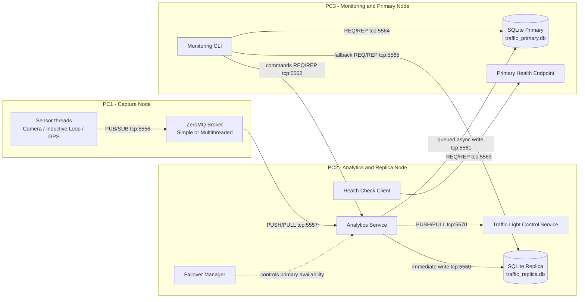
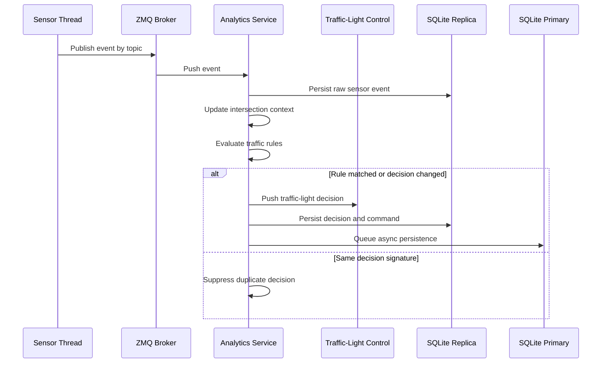
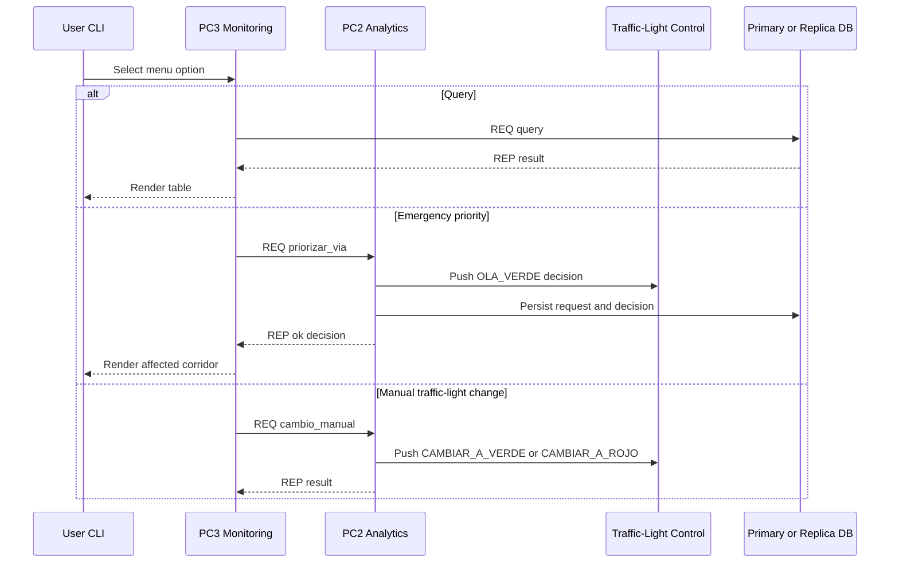
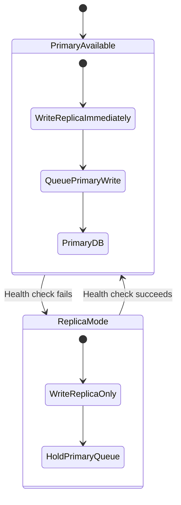
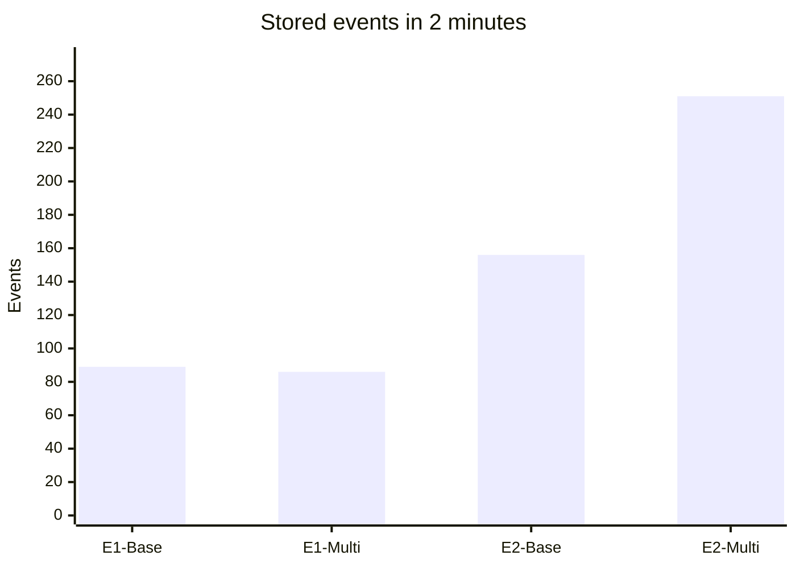
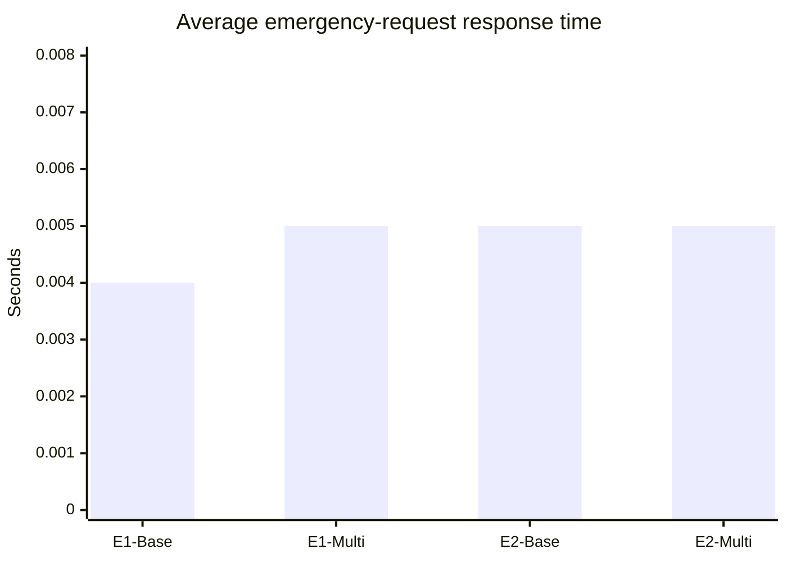

# Intelligent Traffic Urban

## Technical Documentation and Execution Guide

This document describes the architecture, runtime behavior, deployment model, fault-tolerance strategy, persistence model, and performance-test procedure for the intelligent urban traffic management project. It is written for local execution on one computer and distributed execution on three different computers.

The system is a distributed simulation of an urban traffic grid. It models traffic sensors, traffic-state analysis, traffic-light control, user monitoring, primary persistence, replica persistence, and failover. Communication between processes is implemented with ZeroMQ, while persistent state is stored in SQLite databases.

---

## 1. Project Purpose

The project addresses a common urban-mobility problem: traffic lights often react slowly to congestion or special mobility events, such as emergency-vehicle priority. The system receives traffic measurements, classifies the traffic state, executes simulated traffic-light actions, stores operational evidence, and allows user queries from a monitoring interface.

The implementation is not intended to model a real city at production scale. It is a distributed-systems prototype designed to demonstrate asynchronous messaging, synchronous request/response interaction, redundant persistence, failover, and performance comparison between a base broker and a multithreaded broker.

---

## 2. System Scope

The implemented system includes:

- A 3x3 city grid with 9 intersections: `INT-A1` to `INT-C3`.
- 9 simulated traffic lights, one per intersection.
- 27 sensors in the default configuration: one camera, one inductive loop, and one GPS sensor per intersection.
- A base ZeroMQ broker and an alternative multithreaded ZeroMQ broker.
- A traffic analytics service that applies rule-based classification.
- A traffic-light control service that applies simulated red/green state changes.
- A monitoring and query CLI.
- A primary SQLite database on PC3.
- A replica SQLite database on PC2.
- Health-check based failover when PC3 becomes unavailable.
- Performance scripts to measure stored events and emergency-request latency.

Performance scenarios use reduced sensor configurations:

| Scenario | Active sensors | Frequency | Broker design |
|---|---:|---:|---|
| E1-Base | 1 sensor per type | 10 s | Simple broker |
| E1-Multi | 1 sensor per type | 10 s | Multithreaded broker |
| E2-Base | 2 sensors per type | 5 s | Simple broker |
| E2-Multi | 2 sensors per type | 5 s | Multithreaded broker |

---

## 3. Why This Architecture Was Chosen

The project is best understood as an event-driven, service-oriented distributed architecture. It is not a peer-to-peer system because the nodes do not have symmetric responsibilities. It is also not a grid-computing architecture because the goal is not to distribute a large computation across equivalent workers. Instead, each computer has a specialized role: data capture, analytics/control, or monitoring/persistence.

This separation was selected because it matches the real workflow of the traffic domain:

1. Sensors produce events continuously.
2. A broker decouples event producers from the analytics service.
3. Analytics evaluates the traffic state and emits control decisions.
4. Traffic-light control applies the decision.
5. Persistence records events, decisions, commands, requests, and failover events.
6. Monitoring allows the user to query current and historical traffic state or send special instructions.

The architecture also allows the project to be tested in two modes without changing the conceptual design: all components can run locally using loopback addresses, or the same roles can be distributed across three physical computers using LAN IP addresses.

---

## 4. Deployment Model

### 4.1 Logical Distribution

| Node | Role | Main responsibilities |
|---|---|---|
| PC1 | Capture node | Starts the broker and simulated sensors. Publishes traffic events. |
| PC2 | Analytics and resilience node | Receives events, classifies traffic, controls traffic lights, stores replica data, runs failover logic. |
| PC3 | Monitoring and primary database node | Exposes the CLI, stores the primary database, answers queries, exposes health checks. |

### 4.2 Architecture Diagram



---

## 5. Communication Patterns

The design combines asynchronous and synchronous communication.

| Pattern | Used between | Reason |
|---|---|---|
| PUB/SUB | Sensors -> Broker | Sensors publish traffic events without being coupled to a specific consumer. |
| PUSH/PULL | Broker -> Analytics | Events are pushed from the broker to the analytics node without requiring synchronous acknowledgement. |
| PUSH/PULL | Analytics -> Databases | Event, decision, and command persistence is asynchronous so analytics does not block on storage. |
| PUSH/PULL | Analytics -> Traffic-Light Control | Control actions are sent to the traffic-light controller without blocking event processing. |
| REQ/REP | Monitoring -> Analytics | User commands require a direct response. |
| REQ/REP | Monitoring -> Primary/Replica DB | User queries require synchronous results. |
| REQ/REP | Health Check -> PC3 | PC2 must know whether PC3 is available. |

This hybrid interaction model is appropriate because high-frequency sensor traffic should remain asynchronous, while user-facing operations such as queries and manual priority requests require direct responses.

---

## 6. Runtime Ports

| Port | Direction | Purpose |
|---:|---|---|
| 5556 | PC1 local | Sensor PUB/SUB endpoint consumed by the broker. |
| 5557 | PC1 -> PC2 | Broker-to-analytics event stream. |
| 5560 | PC2 local | Replica persistence endpoint. |
| 5561 | PC2 -> PC3 | Primary persistence endpoint. |
| 5562 | PC3 -> PC2 | Monitoring commands to analytics. |
| 5563 | PC2 -> PC3 | Primary health-check endpoint. |
| 5564 | PC3 local / remote query | Primary database query endpoint. |
| 5565 | PC3 -> PC2 | Replica database query endpoint. |
| 5570 | PC2 local | Analytics-to-traffic-light-control endpoint. |

For distributed execution, the required ports must be reachable through the local firewall on the host that binds each service. The current launcher scripts bind server-side endpoints to `0.0.0.0` where remote access is required.

---

## 7. Minimum and Recommended Requirements

### 7.1 Minimum Requirements

| Category | Minimum |
|---|---|
| Execution topology | One computer with three terminals, or three computers connected to the same LAN. |
| CPU | 2 cores. |
| RAM | 4 GB. |
| Operating system | Linux, macOS, or Windows with a compatible terminal. Linux is recommended for easier process and port management. |
| Python | Python 3.10 or newer. |
| Python packages | `PyYAML`, `pyzmq`, `rich`, `matplotlib`. |
| Database | SQLite. |
| Network | Localhost for local testing, LAN connectivity for three-PC deployment. |
| Required ports | `5556`, `5557`, `5560`, `5561`, `5562`, `5563`, `5564`, `5565`, `5570`. |

### 7.2 Recommended Validation Environment

| Category | Recommended |
|---|---|
| CPU | 4 cores or more per node. |
| RAM | 8 GB or more per node. |
| OS | Ubuntu Linux or similar. |
| Python | Python 3.10+. |
| PyZMQ | Recent PyZMQ release compatible with the local Python version. |
| SQLite | SQLite 3.x. |
| Network | Stable wired or campus LAN; avoid NAT/firewall restrictions between PCs. |

---

## 8. Repository Structure

The relevant project structure is:

```text
Inteligent_traffic_urban/
├── config/
│   └── rules.yaml
├── data/
│   ├── schema.sql
│   ├── traffic_primary.db
│   └── traffic_replica.db
├── scripts/
│   ├── run_pc1.py
│   ├── run_pc2.py
│   ├── run_pc3.py
│   ├── medir_metrica1.py
│   ├── medir_metrica2.py
│   ├── graficar_resultados.py
│   └── testing/
│       └── test_emergencia.py
├── src/
│   ├── config/
│   │   ├── system.json
│   │   ├── system_escenario1.json
│   │   └── system_escenario2.json
│   ├── pc1/
│   ├── pc2/
│   ├── pc3/
│   ├── dominio/
│   ├── enums/
│   ├── messaging/
│   ├── persistence/
│   └── utils/
├── tests/
│   └── muestras/
│       ├── events_sensores.json
│       └── indicaciones_directas.json
└── requirements.txt
```

Important files:

| File | Purpose |
|---|---|
| `src/config/system.json` | Default city configuration: 3x3 grid, 27 sensors, 9 traffic lights. |
| `src/config/system_escenario1.json` | Performance scenario 1: 3 sensors total, 10-second interval. |
| `src/config/system_escenario2.json` | Performance scenario 2: 6 sensors total, 5-second interval. |
| `config/rules.yaml` | Traffic-classification and action rules. |
| `data/schema.sql` | SQLite schema for catalog, sensor events, traffic states, commands, user requests, and failover events. |
| `scripts/run_pc1.py` | Starts PC1 broker and sensors. |
| `scripts/run_pc2.py` | Starts PC2 analytics, control service, replica database, failover, and health check. |
| `scripts/run_pc3.py` | Starts PC3 primary database and monitoring CLI. |
| `scripts/testing/test_emergencia.py` | Sends emergency-priority requests and prints latency markers. |
| `scripts/medir_metrica1.py` | Counts stored rows inside a time window. |
| `scripts/medir_metrica2.py` | Extracts latency values from logs containing `delta_seg=`. |
| `scripts/graficar_resultados.py` | Generates the performance chart from the final measured values. |

---

## 9. Domain Model

The city is represented as a matrix of intersections. In the default configuration:

- Rows: `A`, `B`, `C`.
- Columns: `1`, `2`, `3`.
- Intersections: `INT-A1`, `INT-A2`, ..., `INT-C3`.
- Traffic lights: `SEM-A1`, `SEM-A2`, ..., `SEM-C3`.
- Sensor types:
  - Camera: queue length and observed speed.
  - Inductive loop: vehicle count over an interval.
  - GPS: congestion level, average speed, and density.

The model intentionally uses only red and green states. There is no yellow phase in this prototype.

---

## 10. Main Runtime Flow

### 10.1 Sensor-to-Control Flow



### 10.2 Monitoring and Manual Priority Flow



---

## 11. Traffic Rules

The rule engine evaluates the latest camera, inductive-loop, and GPS values per intersection. Rules are defined in `config/rules.yaml` and selected in priority order.

| Rule | Condition | State | Action | Green duration |
|---|---|---|---|---:|
| `R4_PRIORIZACION_AMBULANCIA` | Direct user indication for ambulance priority | `PRIORIZACION` | `OLA_VERDE` | 35 s in rules file; direct command path can send 10 s by default |
| `R3_CONGESTION_SEVERA` | `cola >= 15` and `velocidad_promedio <= 10` and `densidad >= 35` | `CONGESTION` | `EXTENDER_VERDE_Y_GENERAR_ALERTA` | 30 s |
| `R2_CONGESTION_MODERADA` | `cola >= 8` or `velocidad_promedio <= 20` or `densidad >= 25` | `CONGESTION` | `EXTENDER_VERDE` | 25 s |
| `R1_NORMAL` | `cola < 5` and `velocidad_promedio > 35` and `densidad < 20` | `NORMAL` | `MANTENER_TEMPORIZACION` | 15 s |
| `R5_RECUPERACION` | `cola < 5` and `velocidad_promedio > 30` and `densidad < 20` | `NORMAL` | `RESTAURAR_TEMPORIZACION` | 15 s |

The practical precedence is:

```text
Emergency priority > Severe congestion > Moderate congestion > Normal traffic > Recovery/default state
```

This avoids ambiguous behavior when multiple conditions could be true.

---

## 12. Persistence Model

The system uses two SQLite databases:

| Database | Location | Role |
|---|---|---|
| `data/traffic_primary.db` | PC3 | Main persistence and primary query source. |
| `data/traffic_replica.db` | PC2 | Immediate backup and failover query source. |

The schema includes:

| Table | Purpose |
|---|---|
| `interseccion` | Catalog of active intersections. |
| `sensor` | Catalog of sensors and their intersection assignments. |
| `semaforo` | Catalog and current state of traffic lights. |
| `evento_sensor` | Generic sensor-event record with sequence number and payload. |
| `evento_camara` | Camera-specific measurements. |
| `evento_espira` | Inductive-loop-specific measurements. |
| `evento_gps` | GPS-specific measurements. |
| `estado_trafico` | Classified traffic states per intersection. |
| `comando_semaforo` | Traffic-light commands and execution status. |
| `solicitud_usuario` | User query or manual-action records. |
| `solicitud_comando` | Relationship between user requests and commands. |
| `evento_failover` | Health-check, failover, and recovery events. |

Writes are performed immediately to the replica and queued asynchronously for the primary. This design prevents the analytics service from blocking when PC3 is slow or unavailable.

---

## 13. Fault-Tolerance Model

The failure model focuses on a possible PC3 outage. PC3 contains the primary database and the primary query endpoint, so it is the critical node for primary persistence and monitoring queries.

PC2 runs a health-check thread against PC3. When the health check fails, the failover manager marks the primary as unavailable and records a `SWITCH_TO_REPLICA` event. Sensor events and decisions continue to be persisted to the replica. User queries fall back from the primary query endpoint to the replica query endpoint.

When PC3 becomes available again, the health check records `RETURN_TO_PRIMARY`, and the worker responsible for primary persistence resumes sending queued records.



This corresponds to a fail-stop style failure assumption: PC3 stops responding, and the rest of the system detects the failure through timeout-based health checks.

---

## 14. Security Considerations

This is an academic prototype, not a hardened production system. The implemented security model is basic and should be understood as input integrity and operational safety rather than full authentication.

Recommended minimum safeguards:

- Validate JSON structure before processing messages.
- Reject unknown sensor types, unknown intersections, invalid actions, and out-of-range numeric values.
- Restrict the distributed deployment to a trusted LAN.
- Avoid exposing the ZeroMQ ports to public networks.
- Add authentication or message signing before any production-like deployment.
- Log manual actions and failover events for auditability.

---

## 15. Environment Preparation

Run all commands from the project root.

### 15.1 Create and Activate a Virtual Environment

Linux or macOS:

```bash
python3 -m venv .venv
source .venv/bin/activate
python -m pip install --upgrade pip
pip install -r requirements.txt
export PYTHONPATH=$(pwd)
```

Windows PowerShell:

```powershell
python -m venv .venv
.\.venv\Scripts\Activate.ps1
python -m pip install --upgrade pip
pip install -r requirements.txt
$env:PYTHONPATH = (Get-Location).Path
```

### 15.2 Reset the Databases

Execute this before each clean test session:

```bash
rm -f data/traffic_primary.db data/traffic_replica.db
python3 - <<'PY'
import sqlite3
from pathlib import Path
schema = Path('data/schema.sql').read_text(encoding='utf-8')
for db in ['data/traffic_primary.db', 'data/traffic_replica.db']:
    conn = sqlite3.connect(db)
    conn.executescript(schema)
    conn.close()
    print(f'Database initialized: {db}')
PY
```

Windows PowerShell equivalent:

```powershell
Remove-Item data\traffic_primary.db, data\traffic_replica.db -ErrorAction SilentlyContinue
python - <<'PY'
import sqlite3
from pathlib import Path
schema = Path('data/schema.sql').read_text(encoding='utf-8')
for db in ['data/traffic_primary.db', 'data/traffic_replica.db']:
    conn = sqlite3.connect(db)
    conn.executescript(schema)
    conn.close()
    print(f'Database initialized: {db}')
PY
```

### 15.3 Check and Free Ports on Linux

```bash
for PORT in 5556 5557 5560 5561 5562 5563 5564 5565 5570; do
  PIDS=$(lsof -ti tcp:$PORT 2>/dev/null || true)
  if [ -n "$PIDS" ]; then
    echo "Port $PORT is busy. Killing PIDs: $PIDS"
    kill $PIDS 2>/dev/null || true
  else
    echo "Port $PORT is free"
  fi
done
```

---

## 16. Local Execution on One Computer

Local execution is used when all roles run on the same computer. Use three terminals and keep the startup order fixed.

Startup order:

```text
PC3 -> PC2 -> PC1
```

PC3 must be ready before PC2 starts its health check, and PC2 must be ready before PC1 starts publishing events.

### Terminal 1 - PC3

```bash
python scripts/run_pc3.py --pc2-ip 127.0.0.1
```

### Terminal 2 - PC2

```bash
python scripts/run_pc2.py --pc3-ip 127.0.0.1
```

### Terminal 3 - PC1, Simple Broker

```bash
python scripts/run_pc1.py --pc2-ip 127.0.0.1
```

### Terminal 3 - PC1, Multithreaded Broker

```bash
python scripts/run_pc1.py --pc2-ip 127.0.0.1 --multihilo
```

Expected startup evidence:

- PC3 prints primary persistence, query, health, analytics-command, and replica-query endpoints.
- PC2 prints its connection to PC3 and starts analytics, replica persistence, control, failover, and health check.
- PC1 prints whether the simple or multithreaded broker was started and how many sensors are active.
- Sensor logs show increasing `seq` values.

---

## 17. Distributed Execution on Three Computers

Use this mode when PC1, PC2, and PC3 run on different machines in the same LAN.

Example placeholders:

```text
PC1_IP=<PC1_LAN_IP>
PC2_IP=<PC2_LAN_IP>
PC3_IP=<PC3_LAN_IP>
```

Open the required ports on the machine that receives each connection.

### On PC3

```bash
cd Inteligent_traffic_urban
source .venv/bin/activate
export PYTHONPATH=$(pwd)
python scripts/run_pc3.py --pc2-ip <PC2_IP>
```

### On PC2

```bash
cd Inteligent_traffic_urban
source .venv/bin/activate
export PYTHONPATH=$(pwd)
python scripts/run_pc2.py --pc3-ip <PC3_IP>
```

### On PC1, Simple Broker

```bash
cd Inteligent_traffic_urban
source .venv/bin/activate
export PYTHONPATH=$(pwd)
python scripts/run_pc1.py --pc2-ip <PC2_IP>
```

### On PC1, Multithreaded Broker

```bash
cd Inteligent_traffic_urban
source .venv/bin/activate
export PYTHONPATH=$(pwd)
python scripts/run_pc1.py --pc2-ip <PC2_IP> --multihilo
```

The same scripts support local and distributed deployment through the `--pc2-ip` and `--pc3-ip` parameters. This is why the project can be validated on a single local machine and then moved to three separate computers without changing the code structure.

---

## 18. Monitoring CLI

The PC3 CLI exposes the main user operations:

| Option | Operation | Description |
|---:|---|---|
| 1 | Current intersection query | Shows current state, rule, queue length, speed, density, traffic-light state, and data source. |
| 2 | Historical query | Shows traffic states between two timestamps. |
| 3 | Road priority | Sends an emergency corridor request to analytics. |
| 4 | Manual traffic-light change | Forces `CAMBIAR_A_VERDE` or `CAMBIAR_A_ROJO`. |
| 5 | Query by sequence number | Retrieves a sensor event by `seq`. |
| 6 | Exit | Stops the CLI. |

Emergency-priority example through the CLI:

```text
Option: 3
Intersection: INT-B2
Corridor: FILA
Direction: ADELANTE
Detail: Emergency vehicle approaching
```

Manual traffic-light change example:

```text
Option: 4
Intersection: INT-C3
Action: CAMBIAR_A_VERDE
```

---

## 19. Functional Validation Commands

### 19.1 Verify That the Three Sensor Event Types Are Stored

Run after the system has been active for at least 15 seconds:

```bash
python3 - <<'PY'
import sqlite3, time
time.sleep(15)
conn = sqlite3.connect('data/traffic_replica.db')
cur = conn.cursor()
cur.execute('SELECT tipo_evento, COUNT(*) FROM evento_sensor GROUP BY tipo_evento')
for row in cur.fetchall():
    print(row)
conn.close()
PY
```

Expected result: all three event types have counts greater than zero:

```text
LONGITUD_COLA
CONTEO_VEHICULAR
DENSIDAD_TRAFICO
```

### 19.2 Verify End-to-End Traceability

```bash
python3 - <<'PY'
import sqlite3

for label, db in [('REPLICA', 'data/traffic_replica.db'), ('PRIMARY', 'data/traffic_primary.db')]:
    conn = sqlite3.connect(db)
    cur = conn.cursor()
    cur.execute('SELECT seq, tipo_evento, ts_evento, recibido_en FROM evento_sensor ORDER BY seq LIMIT 5')
    print(f'=== {label} ===')
    for row in cur.fetchall():
        print(row)
    conn.close()
PY
```

Success criterion: the same sequence numbers appear in both databases. A small timestamp difference between replica and primary is acceptable because primary persistence is asynchronous.

### 19.3 Verify Traffic-Light Persistence

```bash
python3 - <<'PY'
import sqlite3

for label, db in [('PRIMARY', 'data/traffic_primary.db'), ('REPLICA', 'data/traffic_replica.db')]:
    conn = sqlite3.connect(db)
    cur = conn.cursor()
    cur.execute('SELECT codigo, estado_actual, duracion_base_seg, updated_at FROM semaforo ORDER BY codigo')
    print(f'\n=== {label} ===')
    for row in cur.fetchall():
        print(row)
    conn.close()
PY
```

Success criterion: all 9 traffic lights appear in both databases, and each state is `ROJO` or `VERDE`.

### 19.4 Verify Failover Events

After stopping PC3 and later restarting it:

```bash
python3 - <<'PY'
import sqlite3
conn = sqlite3.connect('data/traffic_replica.db')
cur = conn.cursor()
cur.execute('SELECT tipo_evento, nodo_origen, ocurrido_en FROM evento_failover ORDER BY ocurrido_en DESC LIMIT 10')
for row in cur.fetchall():
    print(row)
conn.close()
PY
```

Success criterion: `SWITCH_TO_REPLICA` appears after PC3 is stopped, and `RETURN_TO_PRIMARY` appears after PC3 is restored.

---

## 20. Performance-Test Methodology

The final performance protocol compares the simple broker against the multithreaded broker under two workload levels.

### 20.1 Metrics

| Metric | Meaning | Collection method |
|---|---|---|
| Stored events in 2 minutes | Counts rows inserted into `evento_sensor`, `estado_trafico`, and `comando_semaforo` during the test window. | `scripts/medir_metrica1.py` |
| Response time | Time from an emergency user request until analytics responds after issuing the traffic-light action. | `scripts/testing/test_emergencia.py` logs and `scripts/medir_metrica2.py` |

### 20.2 Common Protocol for Every Run

1. Stop all running project processes.
2. Reset both databases.
3. Start PC3 first.
4. Start PC2 second.
5. Start PC1 last, using the scenario configuration and broker design being tested.
6. Wait until PC1, PC2, and PC3 print their startup messages.
7. Record the exact start timestamp.
8. Run the experiment for 120 seconds.
9. During the run, send emergency-priority requests from a second PC3 terminal.
10. Record the exact end timestamp.
11. Stop processes in this order: PC1, PC2, PC3.
12. Run the metric scripts using the recorded start and end timestamps.
13. Store logs under `logs/` with scenario-specific names.

---

## 21. Performance Experiments

### 21.1 E1-Base: Scenario 1, Simple Broker

Terminal 1:

```bash
python3 scripts/run_pc3.py 2>&1 | tee logs/E1_base_pc3.txt
```

Terminal 2:

```bash
python3 scripts/run_pc2.py 2>&1 | tee logs/E1_base_pc2.txt
```

Terminal 3:

```bash
python3 scripts/run_pc1.py --config src/config/system_escenario1.json 2>&1 | tee logs/E1_base_pc1.txt
```

Second terminal on PC3:

```bash
echo "INICIO E1_BASE: $(date '+%Y-%m-%d %H:%M:%S')"
export PC2_IP=<PC2_IP_OR_127.0.0.1>
python3 scripts/testing/test_emergencia.py INT-A1 E1_base 2>&1 | tee logs/E1_base_respuesta.txt
sleep 30
python3 scripts/testing/test_emergencia.py INT-B2 E1_base 2>&1 | tee -a logs/E1_base_respuesta.txt
sleep 30
python3 scripts/testing/test_emergencia.py INT-C3 E1_base 2>&1 | tee -a logs/E1_base_respuesta.txt
echo "FIN E1_BASE: $(date '+%Y-%m-%d %H:%M:%S')"
```

### 21.2 E1-Multi: Scenario 1, Multithreaded Broker

Terminal 1:

```bash
python3 scripts/run_pc3.py 2>&1 | tee logs/E1_multi_pc3.txt
```

Terminal 2:

```bash
python3 scripts/run_pc2.py 2>&1 | tee logs/E1_multi_pc2.txt
```

Terminal 3:

```bash
python3 scripts/run_pc1.py --config src/config/system_escenario1.json --multihilo 2>&1 | tee logs/E1_multi_pc1.txt
```

Second terminal on PC3:

```bash
echo "INICIO E1_MULTI: $(date '+%Y-%m-%d %H:%M:%S')"
export PC2_IP=<PC2_IP_OR_127.0.0.1>
python3 scripts/testing/test_emergencia.py INT-A1 E1_multi 2>&1 | tee logs/E1_multi_respuesta.txt
sleep 30
python3 scripts/testing/test_emergencia.py INT-B2 E1_multi 2>&1 | tee -a logs/E1_multi_respuesta.txt
sleep 30
python3 scripts/testing/test_emergencia.py INT-C3 E1_multi 2>&1 | tee -a logs/E1_multi_respuesta.txt
echo "FIN E1_MULTI: $(date '+%Y-%m-%d %H:%M:%S')"
```

### 21.3 E2-Base: Scenario 2, Simple Broker

Terminal 1:

```bash
python3 scripts/run_pc3.py 2>&1 | tee logs/E2_base_pc3.txt
```

Terminal 2:

```bash
python3 scripts/run_pc2.py 2>&1 | tee logs/E2_base_pc2.txt
```

Terminal 3:

```bash
python3 scripts/run_pc1.py --config src/config/system_escenario2.json 2>&1 | tee logs/E2_base_pc1.txt
```

Second terminal on PC3:

```bash
echo "INICIO E2_BASE: $(date '+%Y-%m-%d %H:%M:%S')"
export PC2_IP=<PC2_IP_OR_127.0.0.1>
python3 scripts/testing/test_emergencia.py INT-A1 E2_base 2>&1 | tee logs/E2_base_respuesta.txt
sleep 30
python3 scripts/testing/test_emergencia.py INT-B2 E2_base 2>&1 | tee -a logs/E2_base_respuesta.txt
sleep 30
python3 scripts/testing/test_emergencia.py INT-C3 E2_base 2>&1 | tee -a logs/E2_base_respuesta.txt
echo "FIN E2_BASE: $(date '+%Y-%m-%d %H:%M:%S')"
```

### 21.4 E2-Multi: Scenario 2, Multithreaded Broker

Terminal 1:

```bash
python3 scripts/run_pc3.py 2>&1 | tee logs/E2_multi_pc3.txt
```

Terminal 2:

```bash
python3 scripts/run_pc2.py 2>&1 | tee logs/E2_multi_pc2.txt
```

Terminal 3:

```bash
python3 scripts/run_pc1.py --config src/config/system_escenario2.json --multihilo 2>&1 | tee logs/E2_multi_pc1.txt
```

Second terminal on PC3:

```bash
echo "INICIO E2_MULTI: $(date '+%Y-%m-%d %H:%M:%S')"
export PC2_IP=<PC2_IP_OR_127.0.0.1>
python3 scripts/testing/test_emergencia.py INT-A1 E2_multi 2>&1 | tee logs/E2_multi_respuesta.txt
sleep 30
python3 scripts/testing/test_emergencia.py INT-B2 E2_multi 2>&1 | tee -a logs/E2_multi_respuesta.txt
sleep 30
python3 scripts/testing/test_emergencia.py INT-C3 E2_multi 2>&1 | tee -a logs/E2_multi_respuesta.txt
echo "FIN E2_MULTI: $(date '+%Y-%m-%d %H:%M:%S')"
```

---

## 22. Metric Collection

### 22.1 Metric 1: Stored Records in the Test Window

Run after each experiment using the real timestamps printed by `INICIO` and `FIN`.

On PC3, for the primary database:

```bash
python3 scripts/medir_metrica1.py "YYYY-MM-DD HH:MM:SS" "YYYY-MM-DD HH:MM:SS" E1_base --solo primary
```

On PC2, for the replica database:

```bash
python3 scripts/medir_metrica1.py "YYYY-MM-DD HH:MM:SS" "YYYY-MM-DD HH:MM:SS" E1_base --solo replica
```

Replace `E1_base` with the actual experiment label.

### 22.2 Metric 2: Emergency-Request Response Time

```bash
python3 scripts/medir_metrica2.py logs/E1_base_respuesta.txt
python3 scripts/medir_metrica2.py logs/E1_multi_respuesta.txt
python3 scripts/medir_metrica2.py logs/E2_base_respuesta.txt
python3 scripts/medir_metrica2.py logs/E2_multi_respuesta.txt
```

The script extracts `delta_seg=` values from the emergency-test logs and reports count, average, minimum, and maximum.

---

## 23. Final Performance Results

The final reported values were:

| Experiment | Configuration | Stored events in 2 min | Average response | Minimum | Maximum |
|---|---|---:|---:|---:|---:|
| E1-Base | 1 sensor/type, 10 s, simple broker | 89 | 0.004 s | 0.003 s | 0.006 s |
| E1-Multi | 1 sensor/type, 10 s, multithreaded broker | 86 | 0.005 s | 0.004 s | 0.006 s |
| E2-Base | 2 sensors/type, 5 s, simple broker | 156 | 0.005 s | 0.003 s | 0.006 s |
| E2-Multi | 2 sensors/type, 5 s, multithreaded broker | 251 | 0.005 s | 0.004 s | 0.007 s |

### 23.1 Stored Events Chart



### 23.2 Average Response Time Chart



### 23.3 Result Interpretation

Under low load, the simple broker and the multithreaded broker behave similarly. In Scenario 1, the multithreaded broker stored slightly fewer records than the simple broker, which suggests that the overhead of thread coordination can dominate when the event volume is low.

Under higher load, the multithreaded broker shows the expected scalability benefit. In Scenario 2, stored events increased from 156 to 251, which is approximately a 60.9% improvement:

```text
(251 - 156) / 156 * 100 = 60.9%
```

Response times remained nearly constant across all scenarios, between 0.004 s and 0.005 s on average. This indicates that the higher ingestion capacity of the multithreaded broker did not materially degrade emergency-request latency in the measured runs.

---

## 24. Generate the Performance Chart Image

The repository includes a script that generates `resultados_desempeno.png`:

```bash
python scripts/graficar_resultados.py
```

If `matplotlib` is missing:

```bash
python -m pip install matplotlib
```

The script uses the measured values from the final performance table and produces a two-panel chart: stored events and average response time.

---

## 25. Operational Checklists

### 25.1 Before Running Locally

- Install dependencies with `pip install -r requirements.txt`.
- Export `PYTHONPATH` to the project root.
- Reset the databases if the run must start clean.
- Free ports `5556`, `5557`, `5560`, `5561`, `5562`, `5563`, `5564`, `5565`, and `5570`.
- Start PC3, then PC2, then PC1.

### 25.2 Before Running on Three PCs

- Confirm all PCs are on the same network.
- Confirm each PC can ping the other required IPs.
- Open the required firewall ports.
- Use the correct `--pc2-ip` and `--pc3-ip` values.
- Start PC3 first, PC2 second, PC1 third.
- Use `export PC2_IP=<PC2_IP>` before running `scripts/testing/test_emergencia.py` from a machine that is not PC2.

### 25.3 Before Performance Tests

- Clean both SQLite databases.
- Use scenario-specific PC1 configs.
- Capture terminal output with `tee`.
- Record exact start and end timestamps.
- Keep each run at 120 seconds.
- Stop processes in the defined order: PC1, PC2, PC3.
- Run metric scripts immediately after each experiment.

---

## 26. Known Assumptions and Limitations

- The system simulates traffic; it does not connect to physical sensors or real traffic lights.
- Roads are assumed to be one-way.
- Traffic lights only use `ROJO` and `VERDE`; no yellow phase is modeled.
- SQLite is appropriate for a lab prototype but is not a production-scale traffic database.
- ZeroMQ messages are not encrypted or authenticated in the current implementation.
- The main failure case is PC3 unavailability. The design does not claim Byzantine-fault tolerance.
- Primary persistence is asynchronous, so a small delay between replica and primary records is expected.
- The emergency-priority duration can differ depending on whether it is triggered through static rule configuration or through the direct command path.

---

## 27. Suggested Improvements

Future versions could improve the prototype by adding:

- Environment-based endpoint configuration instead of module-level overrides.
- Authentication for monitoring commands.
- Message schemas with strict validation.
- A dedicated dashboard instead of only a terminal CLI.
- Automated integration tests for all ZeroMQ flows.
- Stress tests with larger grids and configurable sensor counts.
- Persistent replay of queued primary writes after long PC3 outages.
- Structured JSON logs for easier metric extraction.

---

## 28. Quick Start Summary

Local simple run:

```bash
# Terminal 1
python scripts/run_pc3.py --pc2-ip 127.0.0.1

# Terminal 2
python scripts/run_pc2.py --pc3-ip 127.0.0.1

# Terminal 3
python scripts/run_pc1.py --pc2-ip 127.0.0.1
```

Local multithreaded run:

```bash
# Terminal 1
python scripts/run_pc3.py --pc2-ip 127.0.0.1

# Terminal 2
python scripts/run_pc2.py --pc3-ip 127.0.0.1

# Terminal 3
python scripts/run_pc1.py --pc2-ip 127.0.0.1 --multihilo
```

Distributed simple run:

```bash
# PC3
python scripts/run_pc3.py --pc2-ip <PC2_IP>

# PC2
python scripts/run_pc2.py --pc3-ip <PC3_IP>

# PC1
python scripts/run_pc1.py --pc2-ip <PC2_IP>
```

Distributed multithreaded run:

```bash
# PC3
python scripts/run_pc3.py --pc2-ip <PC2_IP>

# PC2
python scripts/run_pc2.py --pc3-ip <PC3_IP>

# PC1
python scripts/run_pc1.py --pc2-ip <PC2_IP> --multihilo
```

Performance scenario example:

```bash
python scripts/run_pc1.py --pc2-ip <PC2_IP_OR_127.0.0.1> --config src/config/system_escenario2.json --multihilo
```
